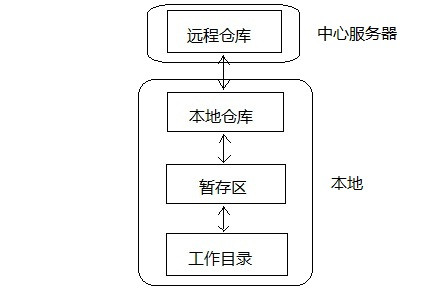
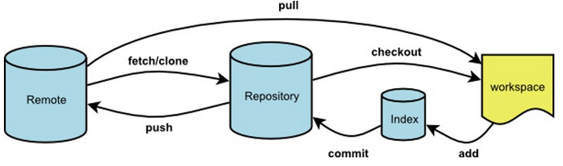

学习完Git对象与引用这两个底层原理后，我们站在更高的维度看看Git的基本工作流程。学些之前，先看看下面两张图：

## 基本工作流

实际工作常用工作流程如下：

1. 克隆远程仓库：git clone git://xxxxxx
2. 切换到对应分支：git checkout <branch-name> (默认是master分支就不用切换)
3. 在工作目录修改文件；
4. 将修改文件添加到**暂存区**：git add -A
5. 将暂存区的修改提交到本地仓库：git commit
6. 将本地仓库新的提交推送到服务器：git push <remote_name> <branch-name>

上述步骤分别对应到本地文件的修改：

1. 克隆仓库：将远程仓库中.git/objects/下的文件拷贝到本地.git/objects/目录下，同时将本地工作空间切换到master分支，修改本地的.git/HEAD,.git/config等文件；
2. 切换分支同1：修改.git/HEAD，.git/config等文件；
3. 在工作目录修改文件，.git目录无文件修改；
4. 这里提到一个重要的概念就是“暂存区”，其实对应的就是.git/index文件，大家可以在git add后查看一下该文件的变化；
5. git commit将暂存区修改提交到本地仓库：清空.git/index，并创建相关对象保存到.git/objects/目录中；
6. git push将本地新建的相关对象（.git/objects/）传输到远程服务器；

上述是基本流程的一个简化描述，各命令修改对应文件可以大致参考图二。
