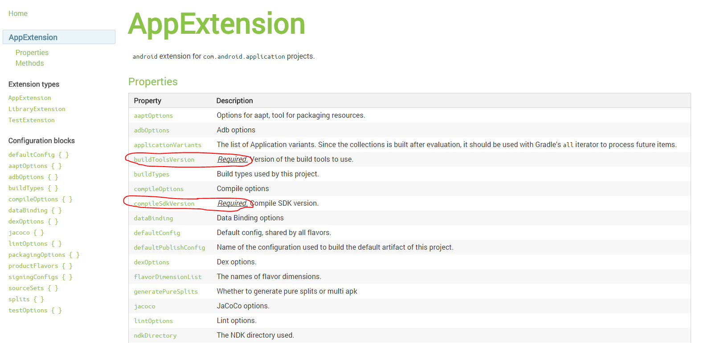

## 概念

Gradle是一个基于Apache Ant和Apache Maven概念的项目自动化建构工具。

Gradle的配置是一种基于Groovy的内部领域特定（DSL）语言。在Android Studio中对应的就是build.gradle。

Groovy是一种动态语言。这种语言比较有特点，它和Java一样，也运行于Java虚拟机中，同时具有像Python， Ruby 和 Smalltalk 语言类似的脚本特性，当执行Groovy脚本时，Groovy会先将其编译成Java类字节码，然后通过Jvm来执行这个Java类。

Groovy的Api文档：http://www.groovy-lang.org/api.html

Gradle是一个框架，作为框架，它负责定义流程和规则，而具体的编译工作则是通过插件的方式来完成的。比如编译Java有Java插件，编译Groovy有Groovy插件，编译Android APP有Android APP插件，编译Android Library有Android Library插件。

因此Gradle包含以下基本组件：

1. project （工程，每个App、Library都是单独的project）
2. plugin （插件）
3. task （任务）
4. settings.gradle 配置多个project

常用命令：

1. gradle projects 
2. gradle tasks

## 仓库

在项目中经常要用到第三方库或插件工具，这些第三方库都是从仓库中下载，在build.gradle经常看到如下仓库配置：

    repositories {
        jcenter()
        mavenCentral()
      }

jcenter是一个由 bintray.com维护的Maven仓库：https://jcenter.bintray.com/

Maven Central 则是由sonatype.org维护的Maven仓库：https://oss.sonatype.org/content/repositories/releases/

国内很多初学者刚开始使用Android Studio打开开源项目的时候会需要下载很多第三方库，但由于国内网络因素很难下载成功，这个时候可以配置仓库镜像，如：

    maven { url "http://mirrors.ibiblio.org/maven2"}
    
同样，企业里面可以配置私有maven仓库。

另外，Android SDK Manager更新也可以代理：

    mirrors.neusoft.edu.cn:80
 

## 插件

Gradle作为一个通用的构建工具，提供了编程框架的功能，这样像Google才可以基于Gradle开发Android Library和Android App的构建工具，也就是所说的插件，在build.gradle常见到这样的配置：

    dependencies {
        classpath 'com.android.tools.build:gradle:2.1.0'
    }

    apply plugin: 'com.android.library'
    apply plugin: 'com.android.application'
    apply plugin: 'java'

App开发工程师则是配置这些插件所需的参数，因此对于不同插件所需参数含义的理解就很重要。

用户向导：`https://developer.android.com/studio/build/index.html`

android plugin DSL在线文档：`http://google.github.io/android-gradle-dsl/`

多渠道多版本输出： productFlavors + buildTypes 

如果源码结构如下：

    src/main/ (the main sourceset)
    src/full/ (the product flavor sourceset)
    src/debug/ (the build type sourceset)

如果不同目录中包含相同的资源名，则按build type > product flavors > main

## 示例

    android {
        compileSdkVersion ANDROID_BUILD_TARGET_SDK_VERSION as int
        buildToolsVersion ANDROID_BUILD_TOOLS_VERSION
     
        defaultConfig {
        }
     
        buildTypes {
        }
     
        compileOptions {
        }
     
        sourceSets {
        }
     
        lintOptions {
        }
     
        productFlavors {
            flavor1 {
            }
     
            flavor2 {
            }
        }
        signingConfigs {
            release {
                storeFile file(×.keystore)
                storePassword ×××
                keyAlias ××××
                keyPassword ×××
            }
        }
    }
    
defaultConfig如下：

    defaultConfig {
        applicationId com.example.qiujuer.application
        minSdkVersion 15
        targetSdkVersion 21
        versionCode 1
        versionName 1.0
     
        ndk {
            moduleName genius
            cFlags -DANDROID_NDK -D_RELEASE
            ldLibs m, log, jnigraphics
            abiFilters all
        }
    }
    
buildTypes会继承defaultConfig

    buildTypes {
        release {
            minifyEnabled false
            proguardFiles getDefaultProguardFile('proguard-android.txt'), 'proguard-rules.pro'
            signingConfig signingConfigs.android_media
        }
        debug {
            signingConfig signingConfigs.android_media
        }
    }
    
sourceSets

以下是一些常用的设置，其中最后一个是引用 *.so 文件的时候使用的方法

    sourceSets {
        main {
            manifest.srcFile 'AndroidManifest.xml'
            java.srcDirs = ['src']
            resources.srcDirs = ['src']
            aidl.srcDirs = ['src']
            renderscript.srcDirs = ['src']
            res.srcDirs = ['res']
            assets.srcDirs = ['assets']
            jniLibs.srcDirs = ['libs']
        }
    }
    
productFlavors：在这里你可以设置你的产品发布的一些东西，比如你现在一共软件需要发布到不同渠道，且不同渠道中的包名不同，那么可以在此进行配置；甚至可以设置不同的 AndroidManifest.xml 文件

    productFlavors {
        flavor1 {
            packageName='com.example.qiujuer.application1'
            manifest.srcFile 'exampleapk/AndroidManifest1.xml'
        }
     
        flavor2 {
            packageName='com.example.qiujuer.application2'
            manifest.srcFile 'exampleapk/AndroidManifest2.xml'
        }
    }
    
## 参考

1. http://www.2cto.com/kf/201501/366464.html
2. http://www.android-studio.org/index.php/docs/guide/135-gradle-2
3. http://tools.android.com/tech-docs/new-build-system/user-guide
4. http://google.github.io/android-gradle-dsl/2.0/
5. http://blog.csdn.net/innost/article/details/48228651