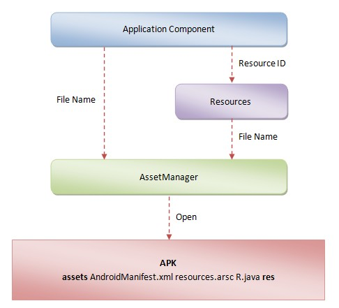

## 说明

在Android系统中，一个进程是可以同时加载多个应用程序的，也就是可以同时加载多个APK文件。每一个APK文件在进程中都对应有一个全局的Resourses对象以及一个全局的AssetManager对象。其中，这个全局的Resourses对象保存在一个对应的ContextImpl对象的成员变量**mResources**中，而这个全局的AssetManager对象保存在这个全局的Resourses对象的成员变量**mAssets**中。

Android应用程序除了要访问自己的资源之外，还需要访问系统的资源。系统的资源打包在**/system/framework/framework-res.apk**文件中，它在应用程序进程中是通过一个单独的Resources对象和一个单独的AssetManager对象来管理的。这个单独的Resources对象就保存在Resources类的静态成员变量**mSystem**中

C++层的AssetManager类有三个重要的成员变量mAssetPaths、mResources和mConfig。

1. mAssetPaths保存的是资源存放目录，如；
2. mResources指向的是一个资源索引表，也就是打包apk的时候生成的resources.arsc；
3. mConfig保存的是设备的本地配置信息，例如屏幕密度和大小、国家地区和语言等等配置信息。

有了这三个成员变量之后，C++层的AssetManager类就可以访问应用程序的资源了。

## Resource对象建立的过程

1. ContextImpl中的mResources是通过LoadedApk.getResources获取的。
2. 而LoadedApk是通过ActivityThread.getTopLevelResources来获得这个Resources对象
    
    (mainThread.getTopLevelResources(mResDir, this)), 需要指定Apk文件路径，文件路径保存在mResDir中，例如，假设我们要获取的Resources对象是用来访问系统自带的音乐播放器的资源的，那么对应的Apk文件路径就为/system/app/Music.apk。

    ActivityThread.getTopLevelResources：
    
        AssetManager assets = new AssetManager(); //见下一小节AssetManager的初始化
        if (assets.addAssetPath(resDir) == 0) { //见下一小节AssetManager的addAssetPath
            return null;
        }
        ......

        r = new Resources(assets, metrics, getConfiguration(), compInfo);

## AssetManager

1. 构造函数中会调用AssetManager.init，init的实现在c++层，init中会调用addDefaultAssets()：

        static const char* kSystemAssets = "framework/framework-res.apk";
        ......
        
        bool AssetManager::addDefaultAssets()
        {
            const char* root = getenv("ANDROID_ROOT");
            ......
        
            String8 path(root);
            path.appendPath(kSystemAssets);
        
            return addAssetPath(path, NULL);
        }

    ANDROID_ROOT环境变量对应的是/system/目录

2. 调用AssetManager::addAssetPath：(c++层）

        static const char* kAppZipName = NULL; //"classes.jar";
        ......
        
        bool AssetManager::addAssetPath(const String8& path, void** cookie)
        {
            AutoMutex _l(mLock);
        
            asset_path ap;
            ......                            
            // add overlay packages for /system/framework; apps are handled by the
            // (Java) package manager
            if (strncmp(path.string(), "/system/framework/", 18) == 0) {
                // When there is an environment variable for /vendor, this
                // should be changed to something similar to how ANDROID_ROOT
                // and ANDROID_DATA are used in this file.
                String8 overlayPath("/vendor/overlay/framework/");
                overlayPath.append(path.getPathLeaf());
                if (TEMP_FAILURE_RETRY(access(overlayPath.string(), R_OK)) == 0) {
                    asset_path oap;
                    oap.path = overlayPath;
                    oap.type = ::getFileType(overlayPath.string());
                    bool addOverlay = (oap.type == kFileTypeRegular); // only .apks supported as overlay
                    if (addOverlay) {
                        oap.idmap = idmapPathForPackagePath(overlayPath);
        
                        if (isIdmapStaleLocked(ap.path, oap.path, oap.idmap)) {
                            addOverlay = createIdmapFileLocked(ap.path, oap.path, oap.idmap);
                        }
                    }
                    if (addOverlay) {
                        mAssetPaths.add(oap);
                    } 
                    ......
                }
            }
        
            return true;
        }

    addAssetPath的最后一个工作是检查刚刚添加的Apk文件路径是否是保存在/system/framework/目录下面的。如果是的话，那么就会在/vendor/overlay/framework/目录下找到一个同名的Apk文件，并且也会将该Apk文件添加到成员变量mAssetPaths所描述的一个Vector中去。这是一种资源覆盖机制，手机厂商可以利用它来自定义的系统资源，即用自定义的系统资源来覆盖系统默认的系统资源，以达到个性化系统界面的目的。

    如果手机厂商要利用上述的资源覆盖机制来自定义自己的系统资源，那么还需要提供一个idmap文件，用来说明它在/vendor/overlay/framework/目录提供的Apk文件要覆盖系统的哪些默认资源，使用资源ID来描述，因此，这个idmap文件实际上就是一个资源ID映射文件。这个idmap文件最终保存在/data/resource-cache/目录下(见idmapPathForPackagePath），并且按照一定的格式来命令，例如，假设手机厂商提供的覆盖资源文件为/vendor/overlay/framework/framework-res.apk，那么对应的idmap文件就会以名称为@vendor@overlay@framework@framework-res.apk@idmap的形式保存在目录/data/resource-cache/下
    
3. AssetManager.addAssetPath：（java层，对应jni层：android_content_AssetManager_addAssetPath），最终也是调用c++层AssetManager::addAssetPath。

4. 成员变量mResources指向的是一个ResTable对象，这个ResTable对象描述的就是一个资源索引表

## 资源查找

Android应用程序资源是可以划分是很多类别的，但是从资源查找的过程来看，它们可以归结为两大类。第一类资源是不对应有文件的，而第二类资源是对应有文件的，例如，字符串资源是直接编译在resources.arsc文件中的，而界面布局资源是在APK包里面是对应的单独的文件的。

1. 以布局文件加载为例，会调用LayoutInflater.inflate：

        public abstract class LayoutInflater {
        ......
    
            public View inflate(int resource, ViewGroup root) {
                return inflate(resource, root, root != null);
            }
        
            ......
        
            public View inflate(int resource, ViewGroup root, boolean attachToRoot) {
                ......
                XmlResourceParser parser = getContext().getResources().getLayout(resource);
                try {
                    return inflate(parser, root, attachToRoot);
                } finally {
                    parser.close();
                }
            }
        
            ......
        }
    
2. Resources类的成员函数getLayout找到了指定的UI布局文件之后，就会打开它。由于Android系统的UI布局文件是一个Xml文件，因此，Resources类的成员函数getLayout打开它之后，得到的是一个XmlResourceParser对象。

        public class Resources {
            ......
        
            public XmlResourceParser getLayout(int id) throws NotFoundException {
                return loadXmlResourceParser(id, "layout");
            }
        
            ......
            
            /*package*/ XmlResourceParser loadXmlResourceParser(int id, String type)
                    throws NotFoundException {
                synchronized (mTmpValue) {
                    TypedValue value = mTmpValue;
                    getValue(id, value, true);
                    if (value.type == TypedValue.TYPE_STRING) {
                        return loadXmlResourceParser(value.string.toString(), id,
                                value.assetCookie, type);
                    }
                    throw new NotFoundException(
                            "Resource ID #0x" + Integer.toHexString(id) + " type #0x"
                            + Integer.toHexString(value.type) + " is not valid");
                }
            }
            
            ......
            
            public void getValue(int id, TypedValue outValue, boolean resolveRefs)
                    throws NotFoundException {
                boolean found = mAssets.getResourceValue(id, outValue, resolveRefs);
                if (found) {
                    return;
                }
                throw new NotFoundException("Resource ID #0x"
                                            + Integer.toHexString(id));
            }
        }
        
3. AssetManager.getResourceValue

        public final class AssetManager {
            ......
        
            private StringBlock mStringBlocks[] = null;
            ......
        
            /*package*/ final boolean getResourceValue(int ident,
                                                       TypedValue outValue,
                                                       boolean resolveRefs)
            {
                int block = loadResourceValue(ident, outValue, resolveRefs);
                if (block >= 0) {
                    if (outValue.type != TypedValue.TYPE_STRING) {
                        return true;
                    }
                    outValue.string = mStringBlocks[block].get(outValue.data);
                    return true;
                }
                return false;
            }
        
            ......
            
            private native final int loadResourceValue(int ident, TypedValue outValue,boolean resolve);
        }

4. android_content_AssetManager_loadResourceValue

        static jint android_content_AssetManager_loadResourceValue(JNIEnv* env, jobject clazz,
                                                                   jint ident,
                                                                   jobject outValue,
                                                                   jboolean resolve)
        {
            AssetManager* am = assetManagerForJavaObject(env, clazz);
            if (am == NULL) {
                return 0;
            }
            const ResTable& res(am->getResources());
        
            Res_value value;
            ResTable_config config;
            uint32_t typeSpecFlags;
            ssize_t block = res.getResource(ident, &value, false, &typeSpecFlags, &config);
            ......
        
            uint32_t ref = ident;
            if (resolve) {
                block = res.resolveReference(&value, block, &ref);
                ......
            }
            return block >= 0 ? copyValue(env, outValue, &res, value, ref, block, typeSpecFlags, &config) : block;
        }

    * 调用函数assetManagerForJavaObject来将参数clazz所描述的一个Java层的AssetManager对象的成员变量mObject转换为一个C++层的AssetManager对象。
    
    * 调用上述得到的C++层的AssetManager对象的成员函数getResources来获得一个ResTable对象，这个ResTable对象描述的是一个资源表。
    
    * 调用上述得到的ResTable对象的成员函数resolveReference来获得与参数ident所对应的资源项值及其配置信息，并且保存在类型为Res_value的变量value以及类型为ResTable_config的变量config中。
    
    * 如果参数resolve的值等于true，那么就继续调用上述得到的ResTable对象的成员函数resolveReference来解析前面所得到的资源项值。
    
    * 调用函数copyValue将上述得到的资源项值及其配置信息拷贝到参数outValue所描述的一个Java层的TypedValue对象中去，返回调用者可以获得与参数ident所对应的资源项内容

5. AssetManager::getResources

        const ResTable& AssetManager::getResources(bool required) const
        {
            const ResTable* rt = getResTable(required);
            return *rt;
        }
        
        const ResTable* AssetManager::getResTable(bool required) const
        {
            ResTable* rt = mResources;
            if (rt) {
                return rt;
            }
        
            // Iterate through all asset packages, collecting resources from each.
        
            AutoMutex _l(mLock);
        
            if (mResources != NULL) {
                return mResources;
            }
        
            ......
        
            const size_t N = mAssetPaths.size();
            for (size_t i=0; i<N; i++) {
                Asset* ass = NULL;
                ResTable* sharedRes = NULL;
                bool shared = true;
                const asset_path& ap = mAssetPaths.itemAt(i);
                Asset* idmap = openIdmapLocked(ap);
                ......
                if (ap.type != kFileTypeDirectory) {
                    if (i == 0) {
                        // The first item is typically the framework resources,
                        // which we want to avoid parsing every time.
                        sharedRes = const_cast<AssetManager*>(this)->
                            mZipSet.getZipResourceTable(ap.path);
                    }
                    if (sharedRes == NULL) {
                        ass = const_cast<AssetManager*>(this)->
                            mZipSet.getZipResourceTableAsset(ap.path);
                        if (ass == NULL) {
                            ......
                            ass = const_cast<AssetManager*>(this)->
                                openNonAssetInPathLocked("resources.arsc",
                                                         Asset::ACCESS_BUFFER,
                                                         ap);
                            if (ass != NULL && ass != kExcludedAsset) {
                                ass = const_cast<AssetManager*>(this)->
                                    mZipSet.setZipResourceTableAsset(ap.path, ass);
                            }
                        }
        
                        if (i == 0 && ass != NULL) {
                            // If this is the first resource table in the asset
                            // manager, then we are going to cache it so that we
                            // can quickly copy it out for others.
                            LOGV("Creating shared resources for %s", ap.path.string());
                            sharedRes = new ResTable();
                            sharedRes->add(ass, (void*)(i+1), false, idmap);
                            sharedRes = const_cast<AssetManager*>(this)->
                                mZipSet.setZipResourceTable(ap.path, sharedRes);
                        }
                    }
                } else {
                    ......
                    Asset* ass = const_cast<AssetManager*>(this)->
                        openNonAssetInPathLocked("resources.arsc",
                                                 Asset::ACCESS_BUFFER,
                                                 ap);
                    shared = false;
                }
                if ((ass != NULL || sharedRes != NULL) && ass != kExcludedAsset) {
                    if (rt == NULL) {
                        mResources = rt = new ResTable();
                        updateResourceParamsLocked();
                    }
                    ......
                    if (sharedRes != NULL) {
                        ......
                        rt->add(sharedRes);
                    } else {
                        ......
                        rt->add(ass, (void*)(i+1), !shared, idmap);
                    }
        
                    if (!shared) {
                        delete ass;
                    }
                }
                if (idmap != NULL) {
                    delete idmap;
                }
            }
        
            ......
            if (!rt) {
                mResources = rt = new ResTable();
            }
            return rt;
        }
        
    getResTable其实就是解析当前应用程序所使用的资源包里面的resources.arsc文件；
    
    另外Android系统的资源管理框架提供了一种idmap机制，用来个性化定制一个资源包里面已有的资源项，也就是说，每一个资源包都可能有一个对应的idmap文件，用来描述它所个性化定制的资源项。在提取和解析资源包的过程中，如果该资源包存在idmap文件，那么该idmap文件也会被解析
    
    

## 参考

1. http://blog.csdn.net/luoshengyang/article/details/8791064
2. http://blog.csdn.net/luoshengyang/article/details/8806798
