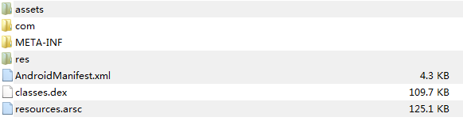

## 说明

一个包是通过什么方式来引用其它包的资源的呢？这就是我们熟悉的资源ID了。
资源ID是一个4字节的无符号整数，其中，最高字节表示Package ID，次高字节表示Type ID，最低两字节表示Entry ID。

Android系统当前定义了两个资源命令空间，其中一个系统资源命令空间，它的Package ID等于0x01，
另外一个是应用程序资源命令空间，它的Package ID等于0x7f。

Type ID是指资源的类型ID。资源的类型有animator、anim、color、drawable、layout、menu、raw、string和xml等等若干种，每一种都会被赋予一个ID。

Entry ID是指每一个资源在其所属的资源类型中所出现的次序。注意，不同类型的资源的Entry ID有可能是相同的，但是由于它们的类型不同，我们仍然可以通过其资源ID来区别开来。

## AAPT打包过程

1. 在编译应用程序资源之前，Android资源打包工具aapt会创建一个AaptAssets对象，用来收集当前需要编译的资源文件。这些需要编译的资源文件就保存在AaptAssets类的成员变量mRes中

        class AaptAssets : public AaptDir
        {
            ......
        
        private:
            ......
        
            KeyedVector<String8, sp<ResourceTypeSet> >* mRes;
        };
    
2. 前面收集到的资源只是保存在一个AaptAssets对象中，这一步需要将这些资源同时增加到一个资源表中去，即增加到前面所创建的一个ResourceTable对象中去，因为最后我们需要根据这个ResourceTable来生成资源索引表，即生成resources.arsc文件

3. 生成资源符号：
   从前面的操作可以知道，所有收集到的资源项都按照类型来保存在一个资源表中，即保存在一个ResourceTable对象。因此，Android资源打包工具aapt只要遍历每一个Package里面的每一个Type，然后取出每一个Entry的名称，并且根据这个Entry在自己的Type里面出现的次序来计算得到它的资源ID，那么就可以生成一个资源符号了，这个资源符号由名称以及资源ID所组成。

    例如，对于strings.xml文件中名称为“start_in_process”的Entry来说，它是一个类型为string的资源项，假设它出现的次序为第3，那么它的资源符号就等于R.string.start_in_process，对应的资源ID就为0x7f050002，其中，高字节0x7f表示Package ID，次高字节0x05表示string的Type ID，而低两字节0x02就表示“start_in_process”是第三个出现的字符串。
    
4. 生成资源索引表：

5. 编译AndroidManifest.xml文件

6. 生成R.java文件

## 打包APK文件

1. assets目录
2. res目录，但是不包括res/values目录， 这是因为res/values目录下的资源文件的内容经过编译之后，都直接写入到资源项索引表去了
3. 资源项索引文件resources.arsc
4. 应用程序的配置文件AndroidManifest.xml
5. 应用程序代码文件classes.dex
6. 描述应用程序的签名信息的文件META-INFO

## 参考

1. http://blog.csdn.net/luoshengyang/article/details/8744683

代码目录

frameworks/base/tools/aapt/