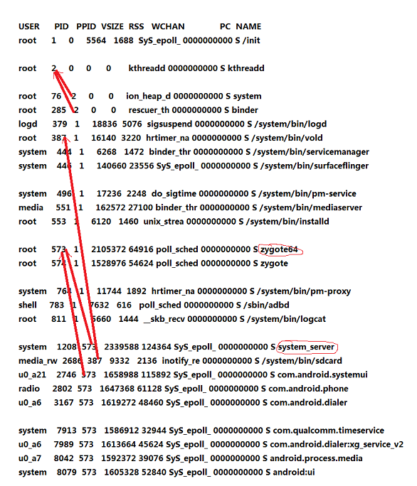
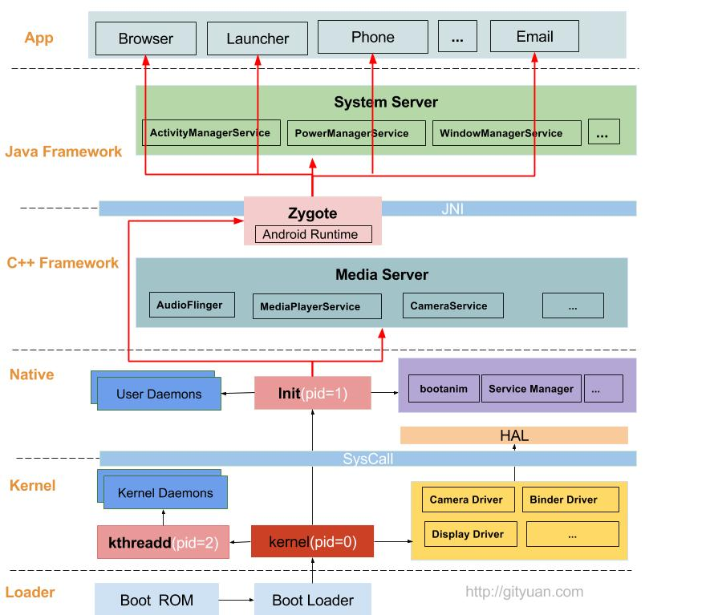
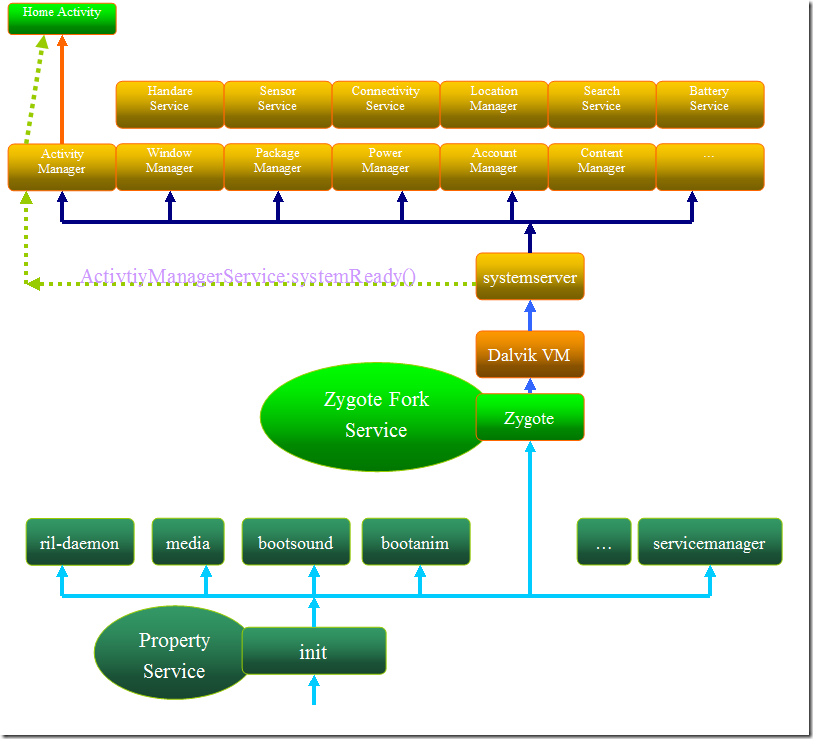

Android系统是基于Linux内核的，而在Linux系统中，所有的进程都是init进程的子孙进程，也就是说，所有的进程都是直接或者间接地由init进程fork出来的。Zygote进程也不例外，它是在系统启动的过程，由init进程创建的。

在系统启动脚本system/core/rootdir/init.zygote64.rc文件中（此处对应的是64位架构），我们可以看到启动Zygote进程的脚本命令：

    service zygote /system/bin/app_process64 -Xzygote /system/bin --zygote --start-system-server
        class main
        socket zygote stream 660 root system
        onrestart write /sys/android_power/request_state wake
        onrestart write /sys/power/state on
        onrestart restart media
        onrestart restart netd
    
在system/core/rootdir/init.rc中通过包含：

    import /init.${ro.zygote}.rc
    
init.rc启动了还有以下等等服务：

1. service ueventd /sbin/ueventd
2. service logd /system/bin/logd
3. service console /system/bin/sh
4. service adbd /sbin/adbd --root_seclabel=u:r:su:s0
5. service servicemanager /system/bin/servicemanager
6. service vold /system/bin/vold
7. service netd /system/bin/netd
8. service ril-daemon /system/bin/rild
9. service surfaceflinger /system/bin/surfaceflinger
10. service media /system/bin/mediaserver
11. service defaultcrypto /system/bin/vdc --wait cryptfs mountdefaultencrypted
12. service encrypt /system/bin/vdc --wait cryptfs enablecrypto inplace default
13. service bootanim /system/bin/bootanimation
14. service installd /system/bin/installd
15. service flash_recovery /system/bin/install-recovery.sh
16. service mtpd /system/bin/mtpd
17. service dumpstate /system/bin/dumpstate -s

## app_process64

Zygote进程要执行的程序便是system/bin/app_process64了，源代码位于frameworks/base/cmds/app _process中。

    int main(int argc, char* const argv[])
    {
        if (prctl(PR_SET_NO_NEW_PRIVS, 1, 0, 0, 0) < 0) {
            // Older kernels don't understand PR_SET_NO_NEW_PRIVS and return
            // EINVAL. Don't die on such kernels.
            if (errno != EINVAL) {
                LOG_ALWAYS_FATAL("PR_SET_NO_NEW_PRIVS failed: %s", strerror(errno));
                return 12;
            }
        }
    
        AppRuntime runtime(argv[0], computeArgBlockSize(argc, argv));
        // Process command line arguments
        // ignore argv[0]
        argc--;
        argv++;
    
        int i;
        for (i = 0; i < argc; i++) {
            if (argv[i][0] != '-') {
                break;
            }
            if (argv[i][1] == '-' && argv[i][2] == 0) {
                ++i; // Skip --.
                break;
            }
            runtime.addOption(strdup(argv[i]));
        }

        // Parse runtime arguments.  Stop at first unrecognized option.
        bool zygote = false;
        bool startSystemServer = false;
        bool application = false;
        String8 niceName;
        String8 className;
    
        ++i;  // Skip unused "parent dir" argument.
        while (i < argc) {
            const char* arg = argv[i++];
            if (strcmp(arg, "--zygote") == 0) {
                zygote = true;
                niceName = ZYGOTE_NICE_NAME;
            } else if (strcmp(arg, "--start-system-server") == 0) {
                startSystemServer = true;
            } else if (strcmp(arg, "--application") == 0) {
                application = true;
            } else if (strncmp(arg, "--nice-name=", 12) == 0) {
                niceName.setTo(arg + 12);
            } else if (strncmp(arg, "--", 2) != 0) {
                className.setTo(arg);
                break;
            } else {
                --i;
                break;
            }
        }
    
        Vector<String8> args;
        if (!className.isEmpty()) {
            // We're not in zygote mode, the only argument we need to pass
            // to RuntimeInit is the application argument.
            //
            // The Remainder of args get passed to startup class main(). Make
            // copies of them before we overwrite them with the process name.
            args.add(application ? String8("application") : String8("tool"));
            runtime.setClassNameAndArgs(className, argc - i, argv + i);
        } else {
            // We're in zygote mode.
            maybeCreateDalvikCache();
    
            if (startSystemServer) {
                args.add(String8("start-system-server"));
            }
    
            char prop[PROP_VALUE_MAX];
            if (property_get(ABI_LIST_PROPERTY, prop, NULL) == 0) {
                LOG_ALWAYS_FATAL("app_process: Unable to determine ABI list from property %s.",
                    ABI_LIST_PROPERTY);
                return 11;
            }
    
            String8 abiFlag("--abi-list=");
            abiFlag.append(prop);
            args.add(abiFlag);
    
            // In zygote mode, pass all remaining arguments to the zygote
            // main() method.
            for (; i < argc; ++i) {
                args.add(String8(argv[i]));
            }
        }
    
        if (!niceName.isEmpty()) {
            runtime.setArgv0(niceName.string());
            set_process_name(niceName.string());
        }
    
        if (zygote) {
            runtime.start("com.android.internal.os.ZygoteInit", args);
        } else if (className) {
            runtime.start("com.android.internal.os.RuntimeInit", args);
        } else {
            fprintf(stderr, "Error: no class name or --zygote supplied.\n");
            app_usage();
            LOG_ALWAYS_FATAL("app_process: no class name or --zygote supplied.");
            return 10;
        }
    }

选项说明：

    // After the parent dir, we expect one or more the following internal
    // arguments :
    //
    // --zygote : Start in zygote mode
    // --start-system-server : Start the system server.
    // --application : Start in application (stand alone, non zygote) mode.
    // --nice-name : The nice name for this process.
    //
    // For non zygote starts, these arguments will be followed by
    // the main class name. All remaining arguments are passed to
    // the main method of this class.
    //
    // For zygote starts, all remaining arguments are passed to the zygote.
    // main function.
    //
    // Note that we must copy argument string values since we will rewrite the
    // entire argument block when we apply the nice name to argv0.
    
最终调用runtime.start("com.android.internal.os.ZygoteInit", args); runtime.start定义在frameworks/base/core/jni/AndroidRuntime.cpp：

    void AndroidRuntime::start(const char* className, const Vector<String8>& options)
    
这个函数的作用是启动Android系统运行时库，它主要做了三件事情，

1. 调用函数startVM启动虚拟机；
2. 调用函数startReg注册JNI方法；
3. 调用了com.android.internal.os.ZygoteInit类的main函数。

ZygoteInit位于frameworks/base/core/java/com/android/internal/os/ZygoteInit.java中：

    public class ZygoteInit {
    	......
    	public static void main(String argv[]) {
    		try {
    			......
    			registerZygoteSocket();
    			......
    			......
    			if (argv[1].equals("true")) {
    				startSystemServer();
    			} else if (!argv[1].equals("false")) {
    				......
    			}
    			......
    			if (ZYGOTE_FORK_MODE) {
    				......
    			} else {
    				runSelectLoopMode();
    			}
    			......
    		} catch (MethodAndArgsCaller caller) {
    			......
    		} catch (RuntimeException ex) {
    			......
    		}
    	}
    	......
    }
    
做了三件事：

1. 调用registerZygoteSocket函数创建了一个socket接口，用来和ActivityManagerService通讯
2. 调用startSystemServer函数来启动SystemServer组件
3. 调用runSelectLoopMode函数进入一个无限循环在前面创建的socket接口上等待ActivityManagerService请求创建新的应用程序进程

结束后：虚拟机启动了，zygoteSocket等待请求，fork SystemServer进程。

## SystemServer进程

frameworks/base/services/java/com/android/server/SystemServer.java：

    /**
     * The main entry point from zygote.
     */
    public static void main(String[] args) {
        new SystemServer().run();
    }
    
    private void run() {
        ......
        // Here we go!
        Slog.i(TAG, "Entered the Android system server!");
        EventLog.writeEvent(EventLogTags.BOOT_PROGRESS_SYSTEM_RUN, SystemClock.uptimeMillis());
        ......
        // Initialize native services.
        System.loadLibrary("android_servers");
        nativeInit();

        // Check whether we failed to shut down last time we tried.
        // This call may not return.
        performPendingShutdown();

        // Initialize the system context.
        createSystemContext();

        // Create the system service manager.
        mSystemServiceManager = new SystemServiceManager(mSystemContext);
        LocalServices.addService(SystemServiceManager.class, mSystemServiceManager);
        
        // Start services.
        try {
            startBootstrapServices();
            startCoreServices();
            startOtherServices();
        } catch (Throwable ex) {
            Slog.e("System", "******************************************");
            Slog.e("System", "************ Failure starting system services", ex);
            throw ex;
        }
        ......
    }
    
**startBootstrapServices**:启动ActivityManagerService、PowerManagerService、DisplayManagerService、PackageManager。

    /**
     * Starts the small tangle of critical services that are needed to get
     * the system off the ground.  These services have complex mutual dependencies
     * which is why we initialize them all in one place here.  Unless your service
     * is also entwined in these dependencies, it should be initialized in one of
     * the other functions.
     */
    private void startBootstrapServices() {
        // Wait for installd to finish starting up so that it has a chance to
        // create critical directories such as /data/user with the appropriate
        // permissions.  We need this to complete before we initialize other services.
        Installer installer = mSystemServiceManager.startService(Installer.class);

        // Activity manager runs the show.
        mActivityManagerService = mSystemServiceManager.startService(
                ActivityManagerService.Lifecycle.class).getService();
        mActivityManagerService.setSystemServiceManager(mSystemServiceManager);
        mActivityManagerService.setInstaller(installer);

        // Power manager needs to be started early because other services need it.
        // Native daemons may be watching for it to be registered so it must be ready
        // to handle incoming binder calls immediately (including being able to verify
        // the permissions for those calls).
        mPowerManagerService = mSystemServiceManager.startService(PowerManagerService.class);

        // Now that the power manager has been started, let the activity manager
        // initialize power management features.
        mActivityManagerService.initPowerManagement();

        // Display manager is needed to provide display metrics before package manager
        // starts up.
        mDisplayManagerService = mSystemServiceManager.startService(DisplayManagerService.class);

        // We need the default display before we can initialize the package manager.
        mSystemServiceManager.startBootPhase(SystemService.PHASE_WAIT_FOR_DEFAULT_DISPLAY);

        // Only run "core" apps if we're encrypting the device.
        String cryptState = SystemProperties.get("vold.decrypt");
        if (ENCRYPTING_STATE.equals(cryptState)) {
            Slog.w(TAG, "Detected encryption in progress - only parsing core apps");
            mOnlyCore = true;
        } else if (ENCRYPTED_STATE.equals(cryptState)) {
            Slog.w(TAG, "Device encrypted - only parsing core apps");
            mOnlyCore = true;
        }

        // Start the package manager.
        Slog.i(TAG, "Package Manager");
        mPackageManagerService = PackageManagerService.main(mSystemContext, installer,
                mFactoryTestMode != FactoryTest.FACTORY_TEST_OFF, mOnlyCore);
        mFirstBoot = mPackageManagerService.isFirstBoot();
        mPackageManager = mSystemContext.getPackageManager();

        Slog.i(TAG, "User Service");
        ServiceManager.addService(Context.USER_SERVICE, UserManagerService.getInstance());

        // Initialize attribute cache used to cache resources from packages.
        AttributeCache.init(mSystemContext);

        // Set up the Application instance for the system process and get started.
        mActivityManagerService.setSystemProcess();
    }
    
**startCoreServices**：启动LightsService、BatteryService、UsageStatsService、WebViewUpdateService。

    /**
     * Starts some essential services that are not tangled up in the bootstrap process.
     */
    private void startCoreServices() {
        // Manages LEDs and display backlight.
        mSystemServiceManager.startService(LightsService.class);

        // Tracks the battery level.  Requires LightService.
        mSystemServiceManager.startService(BatteryService.class);

        // Tracks application usage stats.
        mSystemServiceManager.startService(UsageStatsService.class);
        mActivityManagerService.setUsageStatsManager(
                LocalServices.getService(UsageStatsManagerInternal.class));
        // Update after UsageStatsService is available, needed before performBootDexOpt.
        mPackageManagerService.getUsageStatsIfNoPackageUsageInfo();

        // Tracks whether the updatable WebView is in a ready state and watches for update installs.
        mSystemServiceManager.startService(WebViewUpdateService.class);
    }
    
**startOtherServices**:启动其他相关服务

    /**
     * Starts a miscellaneous grab bag of stuff that has yet to be refactored
     * and organized.
     */
    private void startOtherServices() {
        final Context context = mSystemContext;
        AccountManagerService accountManager = null;
        ContentService contentService = null;
        VibratorService vibrator = null;
        IAlarmManager alarm = null;
        MountService mountService = null;
        NetworkManagementService networkManagement = null;
        NetworkStatsService networkStats = null;
        NetworkPolicyManagerService networkPolicy = null;
        ConnectivityService connectivity = null;
        NetworkScoreService networkScore = null;
        NsdService serviceDiscovery= null;
        WindowManagerService wm = null;
        BluetoothManagerService bluetooth = null;
        UsbService usb = null;
        SerialService serial = null;
        NetworkTimeUpdateService networkTimeUpdater = null;
        CommonTimeManagementService commonTimeMgmtService = null;
        InputManagerService inputManager = null;
        TelephonyRegistry telephonyRegistry = null;
        ConsumerIrService consumerIr = null;
        AudioService audioService = null;
        MmsServiceBroker mmsService = null;
        ......
    }
    
## 进程的角度

1. kthreadd进程: 是所有内核进程的父进程
2. init进程 ： 是所有用户进程的父进程(或者父父进程)
3. zygote进程 ： 是所有上层Java进程的父进程，另外zygote的父进程是init进程。

**重量级进程**

1. servicemanager：是由init孵化而来的，是整个Binder架构(IPC)的大管家，所有大大小小的service都需要先请示servicemanager。
2. mediaserver：是由init孵化而来的，托起整个C++ framework的所有service，比如AudioFlinger, MediaPlayerService等等。
3. system_server：是由zygote孵化而来的，是zygote的首席大弟子，托起整个Java framework的所有service，比如ActivityManagerService, PowerManagerService等等。

查看线程：`ps -t | grep -E "NAME|1208"`  (这里1208是system_server的进程号）

    USER      PID   PPID  VSIZE  RSS   WCHAN              PC  NAME
    system    1208  573   2339588 129792 SyS_epoll_ 0000000000 S system_server
    system    1211  1208  2339588 129792 do_sigtime 0000000000 S Signal Catcher
    system    1213  1208  2339588 129792 unix_strea 0000000000 S JDWP
    system    1214  1208  2339588 129792 futex_wait 0000000000 S ReferenceQueueD
    system    1215  1208  2339588 129792 futex_wait 0000000000 S FinalizerDaemon
    system    1217  1208  2339588 129792 futex_wait 0000000000 S FinalizerWatchd
    system    1218  1208  2339588 129792 futex_wait 0000000000 S HeapTaskDaemon
    system    1225  1208  2339588 129792 binder_thr 0000000000 S Binder_1
    system    1227  1208  2339588 129792 binder_thr 0000000000 S Binder_2
    system    1238  1208  2339588 129792 SyS_epoll_ 0000000000 S android.bg
    system    1239  1208  2339588 129792 SyS_epoll_ 0000000000 S ActivityManager  (AM线程）
    system    1240  1208  2339588 129792 SyS_epoll_ 0000000000 S android.ui
    system    1241  1208  2339588 129792 SyS_epoll_ 0000000000 S android.fg
    system    1252  1208  2339588 129792 inotify_re 0000000000 S FileObserver
    system    1253  1208  2339588 129792 SyS_epoll_ 0000000000 S android.io
    system    1254  1208  2339588 129792 SyS_epoll_ 0000000000 S android.display
    system    1256  1208  2339588 129792 futex_wait 0000000000 S CpuTracker
    system    1257  1208  2339588 129792 SyS_epoll_ 0000000000 S PowerManagerSer
    system    1259  1208  2339588 129792 pm_get_wak 0000000000 S system_server
    system    1260  1208  2339588 129792 futex_wait 0000000000 S BatteryStats_wa
    system    1292  1208  2339588 129792 SyS_epoll_ 0000000000 S PackageManager  （PM线程）
    system    2393  1208  2339588 129792 SyS_epoll_ 0000000000 S PackageInstalle
    system    2395  1208  2339588 129792 SyS_epoll_ 0000000000 S gigaset_led_thr
    system    2400  1208  2339588 129792 SyS_epoll_ 0000000000 S CameraService_p
    ......
 

## 总结

## 参考

1. http://blog.csdn.net/luoshengyang/article/details/6768304
2. http://blog.jobbole.com/67931/
3. http://gityuan.com/2015/12/19/android-process-category/
4. http://gityuan.com/2016/01/30/android-boot/
5. http://gityuan.com/2016/02/05/android-init/