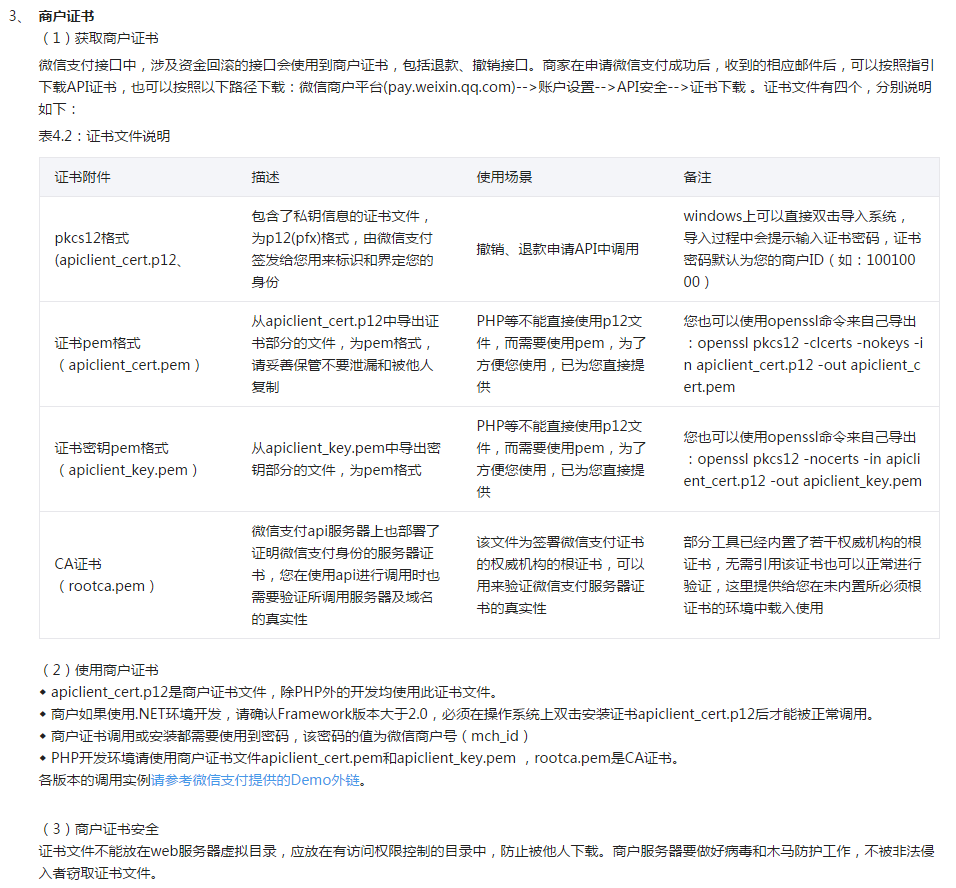

web api常用安全措施：

1. token：减少密码暴露的机会；
2. 签名：一定程度上保证数据有效不被篡改（如果签名规则公开，则有暴露危险，签名规则如何动态？放服务器？）；将所有用户请求的参数按照字母排序（包括timestamp，token），然后更具MD5加密（可以加点盐），全部大写，生成sign签名；
3. nonce_str，随机字段，主要保证签名不可预测
4. timestamp: 判断服务器接到请求的时间和参数中的时间戳是否相差很长一段时间（时间自定义如半个小时），如果超过则说明该                         url已经过期（如果url被盗，他改变了时间戳，但是会导致sign签名不相等）;(注：不用系统时间，用服务器与本地时间差进行校准）;
5. 密钥交换：ECDH
6. RSA私钥加密公钥解密：服务器身份认证
7. 对称加密：加密数据（密钥用密钥交换）

## 身份认证

* 例如微信商户证书：https://pay.weixin.qq.com/wiki/doc/api/jsapi.php?chapter=4_3

## 参考

1. http://blog.csdn.net/fengshizty/article/details/48754609
2. https://pay.weixin.qq.com/wiki/doc/api/jsapi.php?chapter=4_3