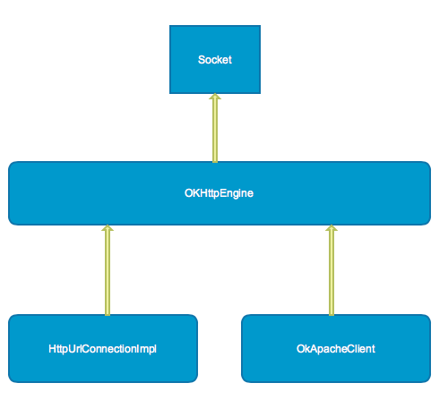

## 历史

最早的时候Android只有两个主要的HTTP客户端： HttpURLConnection, Apache HTTP Client。根据Google官方博客的内容，HttpURLConnection在早期的Android版本中可能存在一些Bug:

> 在Froyo版本之前，HttpURLConnection包含了一些很恶心的错误。特别是对于关闭可读的InputStream时候可能会污染整个连接池。

同时Google官方认为Apache HTTP Client中的API过于复杂而不想用它，在最新的6.0里也去掉了。

但对于大部分普通开发者而言，它们觉得应该根据不同的版本使用不同的客户端。对于Gingerbread(2.3)以及之后的版本，HttpURLConnection会是最佳的选择，它的API更简单并且体积更小。透明压缩与数据缓存可以减少网络压力，提升速度并且能够节约电量。当我们审视Google Volley的源代码的时候，可以看得出来它也是根据不同的Android版本选择了不同的底层的网络请求库：

    if(stack == null) {
        if(VERSION.SDK_INT >= 9) {
            stack = new HurlStack();
        } else {
            stack = new HttpClientStack(AndroidHttpClient.newInstance(userAgent));
        }
    }
    
这样会很让开发者头疼，2013年，Square为了解决这种分裂的问题发布了OkHttp。OkHttp是直接架构与Java Socket本身而没有依赖于其他第三方库，因此开发者可以直接用在JVM中，而不仅仅是Android。为了简化代码迁移速度，OkHttp也实现了类似于HttpUrlConnection与Apache Client的接口。

## 使用

## 参考

1. https://packetzoom.com/blog/which-android-http-library-to-use.html
2. https://segmentfault.com/a/1190000003965158